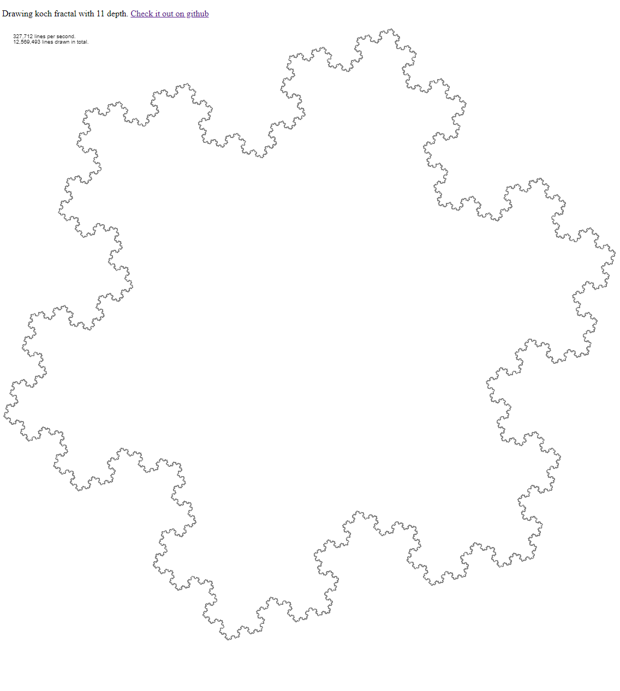

SnowFlake
=========

This is a hobby project. 
Clone repo and open snowflake/snowflake.html in your browser

Goal
----
- create a koch fractal using html5 canvas.
- memory efficient
- async (draw lines that are calculated, want to see a growing image.)
